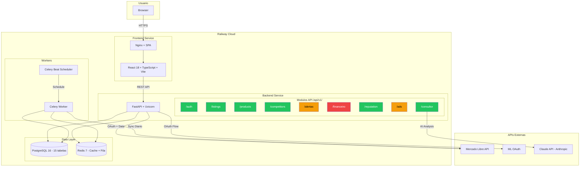
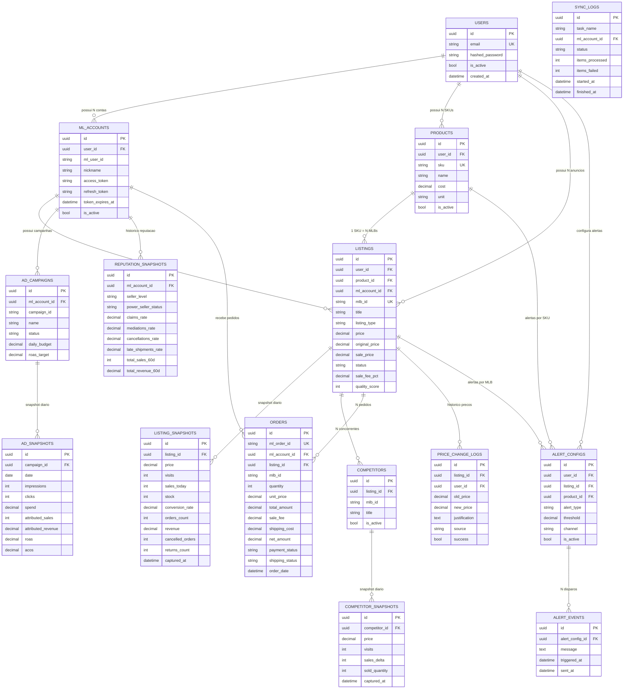
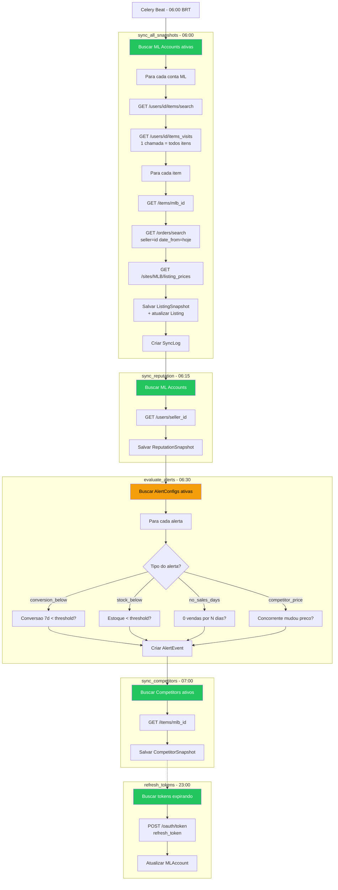
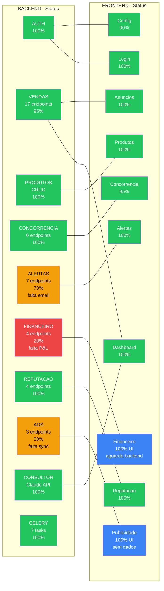
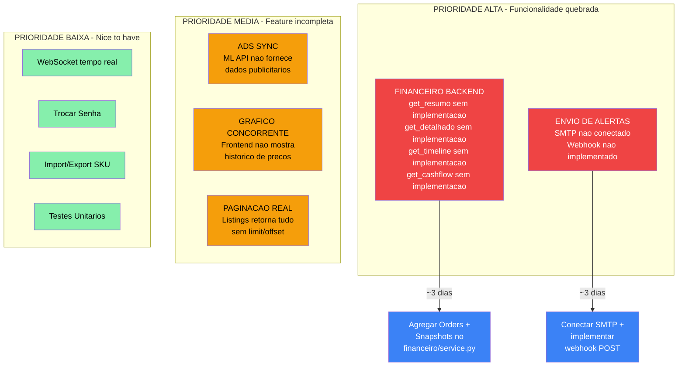
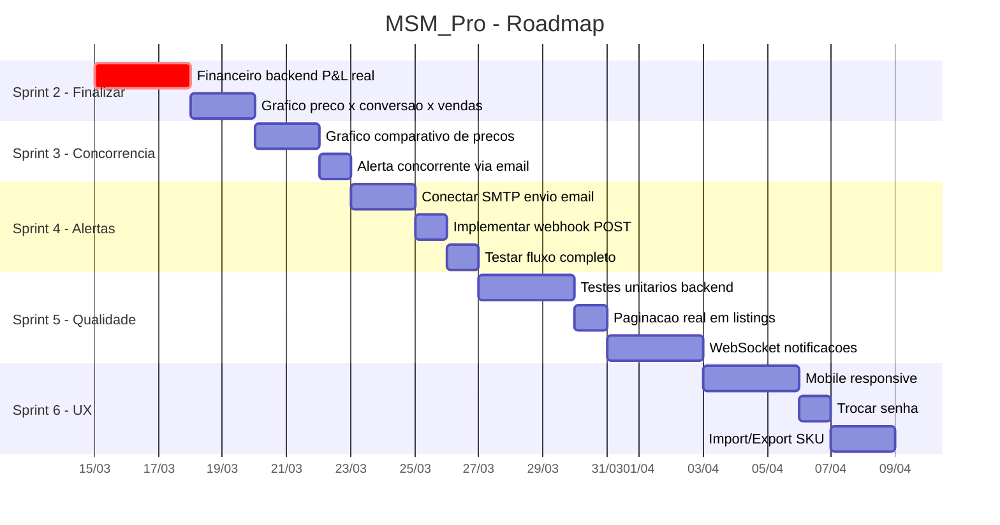

# MSM_Pro — Arquitetura Visual (Diagramas Mermaid)

> Abra este arquivo no GitHub para ver os diagramas renderizados automaticamente.
> Alternativa: cole os blocos em [mermaid.live](https://mermaid.live/edit)

---

## 1. Arquitetura Geral do Sistema

**Legenda de cores:**
- Verde = Producao (100% funcional)
- Amarelo = Parcial (logica OK, falta integracao)
- Vermelho = Esqueleto (endpoints existem, sem implementacao real)

---

## 2. Modelo de Dados (ERD) — 15 Tabelas

---

## 3. Fluxo de Sync Diario (Celery Beat)

---

## 4. Status Backend vs Frontend

---

## 5. Gaps e Prioridades

---

## 6. Roadmap de Implementacao

---

## 7. Jornada do Usuario

```mermaid
flowchart LR
    subgraph SETUP["Setup Inicial"]
        S1["Login email+senha"] --> S2["Conectar conta ML\nOAuth"]
        S2 --> S3["Cadastrar SKUs\ncom custo"]
        S3 --> S4["Vincular MLBs\naos SKUs"]
    end

    subgraph DIARIO["Uso Diario"]
        D1["Ver Dashboard\nKPIs do dia"] --> D2["Analisar\nanuncio individual"]
        D2 --> D3["Consultar IA\nsobre preco"]
        D3 --> D4["Ajustar preco\nvia sistema"]
    end

    subgraph MONITOR["Monitoramento"]
        M1["Configurar alertas\nestoque/conversao"] --> M2["Adicionar\nconcorrentes"]
        M2 --> M3["Ver reputacao\ne riscos"]
        M3 --> M4["Analisar\nfinanceiro P&L"]
    end

    S4 --> D1
    D4 --> M1

    style S1 fill:#22c55e,color:#fff
    style S2 fill:#22c55e,color:#fff
    style S3 fill:#22c55e,color:#fff
    style S4 fill:#22c55e,color:#fff
    style D1 fill:#22c55e,color:#fff
    style D2 fill:#22c55e,color:#fff
    style D3 fill:#22c55e,color:#fff
    style D4 fill:#22c55e,color:#fff
    style M1 fill:#22c55e,color:#fff
    style M2 fill:#22c55e,color:#fff
    style M3 fill:#22c55e,color:#fff
    style M4 fill:#ef4444,color:#fff
```

**Legenda:** Verde = funcional | Vermelho = backend incompleto

---

## 8. Resumo Executivo

| Metrica | Valor |
|---------|-------|
| Tabelas no banco | 15 |
| Endpoints API | ~55 |
| Paginas frontend | 11 |
| Migrations Alembic | 13 |
| Celery tasks | 7 |
| Chamadas ML API | 14 |
| Modulos backend | 10 |
| **Completude geral** | **~80%** |

### Status por Area

| Area | Backend | Frontend | Status |
|------|---------|----------|--------|
| Auth + OAuth ML | 100% | 100% | Producao |
| Sync de dados ML | 100% | - | Producao |
| Dashboard + KPIs | 100% | 100% | Producao |
| Analise por MLB | 95% | 100% | Producao |
| Cadastro SKU | 100% | 100% | Producao |
| Concorrencia | 100% | 85% | Falta grafico |
| Alertas | 70% | 100% | Falta email/webhook |
| **Financeiro** | **20%** | **100%** | **Gap critico** |
| Reputacao | 100% | 100% | Producao |
| Publicidade | 50% | 100% | API ML indisponivel |
| Consultor IA | 100% | 100% | Producao |
